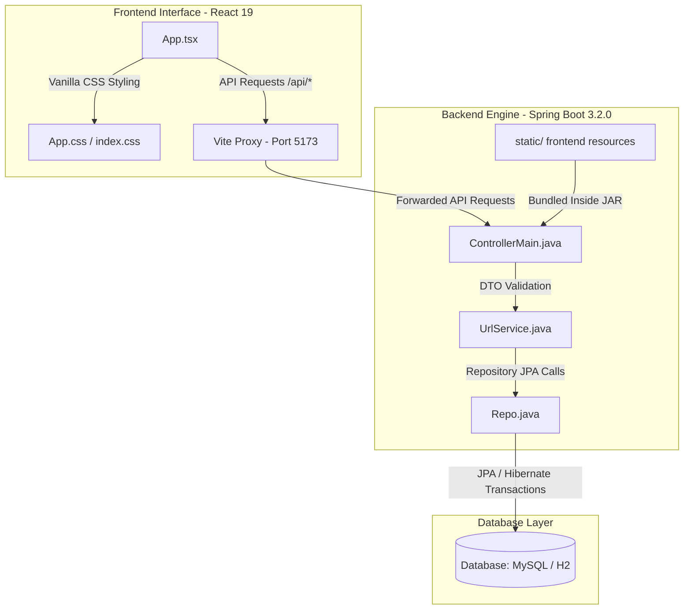
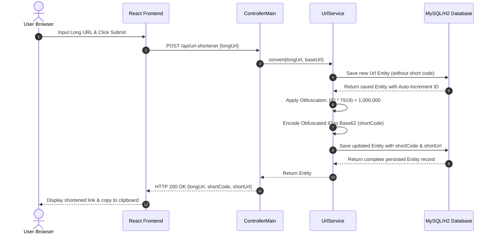
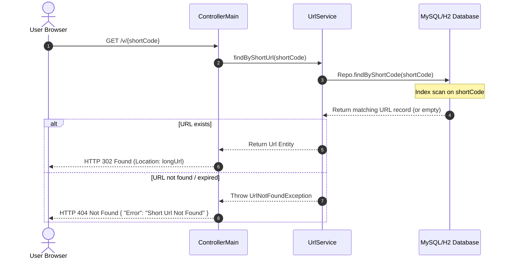

# 🚀 VamanaSutra (SHR.NK) - High-Performance URL Shortener & Redirection Service

VamanaSutra (SHR.NK) is a modern, production-grade, Full-Stack URL Shortener and Redirection platform. Built on top of a highly resilient **Spring Boot** backend and a reactive **React/Vite** frontend, it leverages a custom Base62 encoding and ID-obfuscation mechanism to provide secure, shortened link aliases.

---

## 🗺️ Architectural Overview

The application is structured as a **Modified Monolith**. In development, the React frontend and Spring Boot backend run independently (linked via Vite proxy). In production, the React frontend is compiled and compiled assets are embedded directly into the Spring Boot JAR resources (`static/` folder) and served as a unified containerized deployment.

### 🏗️ Component Architecture


### 📂 Directory Structure Walkthrough
*   [pom.xml](file:///c:/Users/Admin/Vamanasutra/pom.xml): Maven project config and backend dependencies.
*   [Dockerfile](file:///c:/Users/Admin/Vamanasutra/Dockerfile): Three-stage optimized Docker deployment build specification.
*   `src/main/java/com/urlShortener/`:
    *   [UrlShortenerApplication.java](file:///c:/Users/Admin/Vamanasutra/src/main/java/com/urlShortener/UrlShortenerApplication.java): Spring Boot startup class.
    *   [Controller/ControllerMain.java](file:///c:/Users/Admin/Vamanasutra/src/main/java/com/urlShortener/Controller/ControllerMain.java): API controllers exposing endpoints for shortening, health checks, and redirections.
    *   [Service/UrlService.java](file:///c:/Users/Admin/Vamanasutra/src/main/java/com/urlShortener/Service/UrlService.java): Core business logic (Base62 mapping, ID obfuscation logic, Redirection lookup).
    *   [Model/Url.java](file:///c:/Users/Admin/Vamanasutra/src/main/java/com/urlShortener/Model/Url.java): Persistent JPA Entity representing the mapping schema.
    *   [Repository/Repo.java](file:///c:/Users/Admin/Vamanasutra/src/main/java/com/urlShortener/Repository/Repo.java): Data Access Layer defining custom query methods using Spring Data JPA.
    *   [Exception/](file:///c:/Users/Admin/Vamanasutra/src/main/java/com/urlShortener/Exception/): Global exception interceptor and custom system errors.
*   `frontend/`:
    *   [frontend/src/App.tsx](file:///c:/Users/Admin/Vamanasutra/frontend/src/App.tsx): Core React UI logic.
    *   [frontend/src/App.css](file:///c:/Users/Admin/Vamanasutra/frontend/src/App.css): Premium interface layout, animations, and typography.
    *   [frontend/vite.config.ts](file:///c:/Users/Admin/Vamanasutra/frontend/vite.config.ts): Development reverse proxy config mapping `/api` endpoints to backend.

---

## ⚡ Core Algorithms & Dataflow

### 1. URL Shortening Pipeline
The short link creation relies on database primary key generation combined with prime-based obfuscation and Base62 encoding:
1.  **First Save:** A record with the original `longUrl` is saved to retrieve the database's auto-generated integer `id`.
2.  **Obfuscation:** The ID is obfuscated to prevent sequential enumeration (scraping) attacks using:
    $$\text{obfuscatedId} = (\text{id} \times 7919) + 1,000,000$$
    *(where $7919$ is a prime number, and $1,000,000$ acts as a minimum padding offset).*
3.  **Base62 Encoding:** The obfuscated integer is converted to an alphanumeric Base62 string using character set `0-9a-zA-Z`.
4.  **Second Save:** The newly generated `shortCode` and full dynamic redirect URL are saved back to the database.



### 2. Redirection Pipeline
Redirection is optimized using direct indexing on the unique `shortCode` column:



---

## 📡 REST API Documentation

### 1. Health Check
Checks if the URL Shortener service is online.
*   **Method:** `GET`
*   **Endpoint:** `/health`
*   **Response Headers:** `Content-Type: application/json`
*   **Response Body (JSON):**
    ```json
    {
      "Status": "SHR.NK Service is Online",
      "Message": "App is running successfully!"
    }
    ```

### 2. Shorten URL
Shortens a target long URL and returns the fully qualified shortened URL.
*   **Method:** `POST`
*   **Endpoint:** `/api/url-shortener`
*   **Request Headers:** `Content-Type: application/json`
*   **Request Body (JSON):**
    ```json
    {
      "longUrl": "https://example.com/very/long/path/to/some/resource?ref=sharing&utm_source=docs"
    }
    ```
*   **Success Response (HTTP 200 OK):**
    ```json
    {
      "id": 1,
      "longUrl": "https://example.com/very/long/path/to/some/resource?ref=sharing&utm_source=docs",
      "shortCode": "4bX5",
      "shortUrl": "http://localhost:5000/v/4bX5"
    }
    ```
*   **Error Response (HTTP 400 Bad Request):**
    ```json
    {
      "Error": "Enter Valid Url"
    }
    ```

### 3. Redirect Short Link (Primary)
Exposes the public-facing redirection path.
*   **Method:** `GET`
*   **Endpoint:** `/v/{shortCode}`
*   **Parameters:** `shortCode` (string, path parameter)
*   **Success Response (HTTP 302 Found):**
    *   *Headers:* `Location: [longUrl]`
*   **Error Response (HTTP 404 Not Found):**
    ```json
    {
      "Error": "Short Url Not Found"
    }
    ```

### 4. Redirect Short Link (Alternative API Path)
Redirection path exposed via the API prefix namespace.
*   **Method:** `GET`
*   **Endpoint:** `/api/{shortCode}`
*   **Parameters:** `shortCode` (string, path parameter)
*   **Success Response (HTTP 302 Found):**
    *   *Headers:* `Location: [longUrl]`
*   **Error Response (HTTP 404 Not Found):**
    ```json
    {
      "Error": "Short Url Not Found"
    }
    ```

---

## 💾 Database Entity Schema

The data model is mapped to a table using Spring Data JPA.

### Entity: `Url` (mapped via [Url.java](file:///c:/Users/Admin/Vamanasutra/src/main/java/com/urlShortener/Model/Url.java))
| Attribute | Data Type | Database Column Properties | Purpose |
| :--- | :--- | :--- | :--- |
| `id` | `int` | Primary Key, Auto-Increment (`GenerationType.IDENTITY`) | Database unique identifier |
| `longUrl` | `String` | `@Column(nullable = false)` | Original destination URL target |
| `shortCode` | `String` | `@Column(unique = true)` | Alphanumeric representation derived from obfuscated ID |
| `shortUrl` | `String` | Standard String Column | Fully-constructed direct redirect URL |

### ORM Configuration details
Configured via `spring.jpa.hibernate.ddl-auto=update` in [application.properties](file:///c:/Users/Admin/Vamanasutra/src/main/resources/application.properties), enabling Hibernate to dynamically alter target tables on startup to conform to metadata schema models.

---

## ⚙️ Environment Variables & Deployment Configurations

The service uses a fallback configuration design, permitting rapid deployment to platforms like **Railway.app** or **Render.com**.

### Configuration Mapping:
*   `PORT`: Port binding (Defaults to `5000` via Spring's `${PORT:5000}`).
*   `DATABASE_URL` / `MYSQL_URL`: Configures Spring's datasource. If neither exists, the application boots up using a local in-memory H2 database under MySQL compatibility mode (`jdbc:h2:mem:urlshortener;MODE=MySQL`).
*   `MYSQLUSER`: Database username (Defaults to `admin`).
*   `MYSQLPASSWORD`: Database password (Defaults to blank).

### Docker Integration:
The system uses a 3-Stage build strategy defined in the root [Dockerfile](file:///c:/Users/Admin/Vamanasutra/Dockerfile):
1.  **Stage 1 (Vite frontend compilation):** Resolves npm packages, compiles TypeScript, and outputs static bundles using Node 20.
2.  **Stage 2 (Maven backend build):** Generates static resource folders, copies the built React code directly to backend resources, and packages the app jar.
3.  **Stage 3 (Production runner):** Exports a lightweight JRE 17 runner containing only the runnable jar.

---

## 🛠️ Local Setup & Execution Instructions

### Prerequisites
*   Java JDK 17 installed
*   Node.js 20+ installed
*   Maven 3.x (or wrapper scripts provided)

### Step 1: Frontend Development Run
Navigate to frontend folder, install packages, and boot up development hot-reloads:
```bash
cd frontend
npm install
npm run dev
```
*Access frontend UI on [http://localhost:5173](http://localhost:5173)*

### Step 2: Backend Development Run
Run standard Spring Boot application task from the project root:
```bash
mvnw.cmd spring-boot:run
```
*Access API health check on [http://localhost:5000/health](http://localhost:5000/health)*


